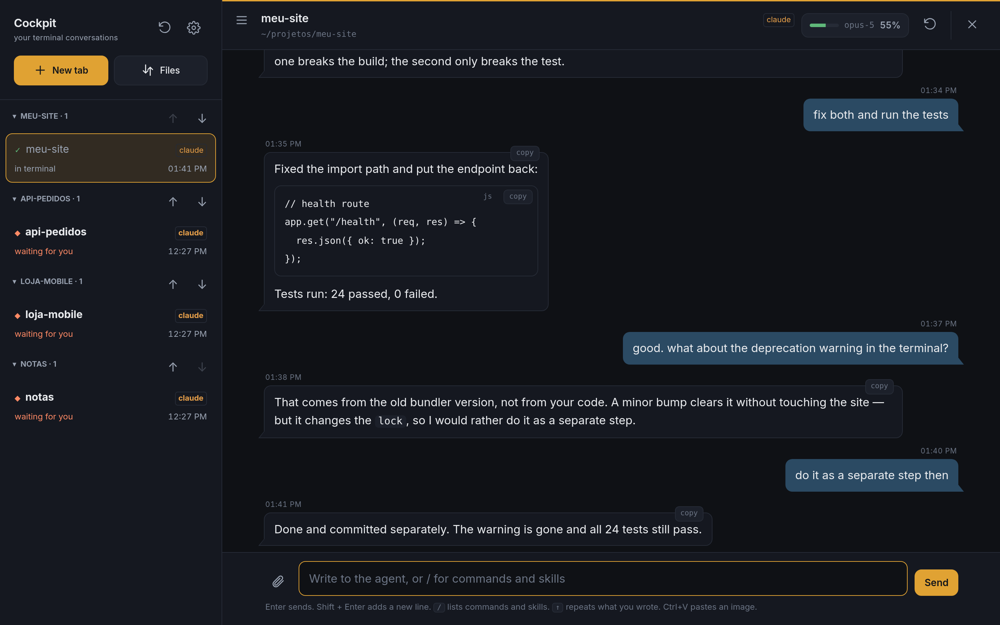
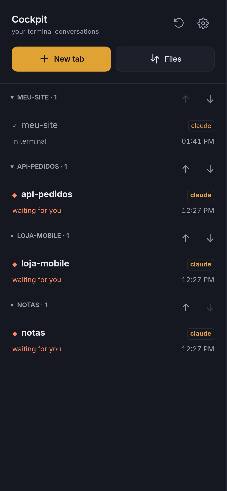
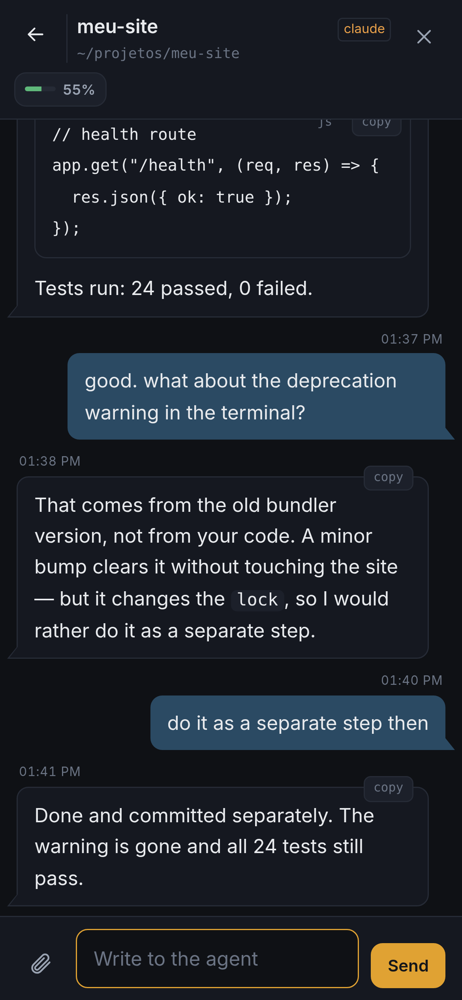

# Cockpit de Agentes

[Português](README.md) | English

A web interface for conversations with **Claude Code and Codex CLI running in tmux panes**. Use it from your computer or phone. The server runs on your Linux machine; agents keep working when you close the browser.

Cockpit runs on **localhost by default**. Tailscale, another VPN, or a reverse proxy are optional ways to access it remotely. Adapt the configuration to your setup without editing the code. This is a tool for a single trusted user, not a multi-user service.

## What it looks like



On the desktop, tmux tabs sit on the left and the conversation on the right. On the phone, the same session — the list first, the conversation once you tap it:

| Tabs | Conversation |
|---|---|
|  |  |

> The images are generated by `testes/print-vitrine.js` against example tabs and conversations.

## Why this project exists

I created this Cockpit to continue the same work from any device: a computer, phone, or tablet. The idea is to access the same files and sessions without having to reconstruct conversations, context, or decisions every time I switch devices.

The work stays on the machine running the agents. The browser is the way in. Switching devices does not require starting another session or copying the project elsewhere. Continuity depends on the records and capabilities of the harness you use; Cockpit does not create unlimited memory or replace backups.

## Free to choose and adapt

The project is not tied to Claude Code, Codex, or any model provider. Its goal is to provide an interface for whichever harness you want to use — the tool that runs the agent and manages its sessions. **The integrations implemented today are Claude Code and Codex CLI.** Other harnesses require integration work; installing another CLI alone does not make it compatible.

You choose where to run it and how to connect: localhost, Tailscale, another VPN, or a reverse proxy. You can also fork, modify, redistribute, and use the code commercially under the [MIT license](LICENSE), keeping the copyright and license notices. You do not need permission or have to contribute changes back to maintain your own fork. Third-party agents, models, and assets remain subject to their own licenses and terms.

## Features

| Feature | Availability |
|---|---|
| Claude Code and Codex CLI conversations | CLI history and SSE updates |
| Terminal tabs | Open, monitor, message, and close panes |
| Attachments, commands, and skills | File sending and agent-specific autocomplete |
| Desktop and mobile | Responsive layout, side-by-side panels, and PWA |
| Notifications and files | Web Push with a secure context and VAPID contact; [optional Taildrop](docs/configuracao.md) |
| Orchestrator jobs | Read straight from disk, no external service; configurable folder |

## Requirements

| Component | Requirement |
|---|---|
| Server | Linux with `/proc`, Node.js 22.16+, and tmux |
| Agent | Claude Code or Codex CLI installed and authenticated under the same Linux user |
| Client | Modern browser; HTTPS for remote access with PWA and notifications |
| npm dependencies | None to run the server or offline tests |

Install and authenticate your agent following the [Claude Code](https://code.claude.com/docs/en/setup) or [Codex CLI](https://learn.chatgpt.com/docs/codex/cli) documentation. Cockpit does not include those tools or their credentials. Model usage follows your CLI account and configuration.

## Local installation

1. Download the code and open the `cockpit-agentes` folder. Check the requirements:

   ```bash
   node --version
   tmux -V
   command -v claude
   command -v codex
   ```

   You only need one of the two agents. Run it in the terminal to complete login and initial confirmations.

2. Create the configuration, preserving any existing `.env`:

   ```bash
   test -e .env || cp .env.example .env
   chmod 600 .env
   ```

   In `.env`, set `COCKPIT_BIN_CLAUDE` and/or `COCKPIT_BIN_CODEX` to the paths returned by `command -v`. Set `COCKPIT_PROJETOS_DIR` to the folder containing your projects. Use absolute paths; `~` and `$HOME` are not expanded inside the file.

3. Open a tmux session. This preserves `main` if it already exists:

   ```bash
   tmux has-session -t main 2>/dev/null || tmux new-session -d -s main
   ```

4. Start the server:

   ```bash
   npm start
   ```

5. Open **http://localhost:7879**, click **New tab**, and choose a project and agent. The default projects folder is `~/projetos`. Hidden directories and project symlinks are excluded from the list.

No build or `npm install` is needed. `npm start` uses Node's support for [`.env` files](https://nodejs.org/api/cli.html#--env-file-if-existsfile). Variables already exported in the environment take precedence over the file.

## Interface language

In **Settings → This device → Language**, choose **Português** or **English**. The change is immediate, without reloading the page, and is saved in this browser. On first access, English-language browsers use English; other browsers use Portuguese.

This setting changes interface controls and labels. Messages, filenames, commands, and agent responses keep their original content. Each device can use a different language.

## Your setup

| Setting in `.env` | Default | When to change it |
|---|---|---|
| `HOST` / `PORT` | `127.0.0.1` / `7879` | Server address and port |
| `COCKPIT_PROJETOS_DIR` | `~/projetos` | Projects in another folder |
| `COCKPIT_BIN_CLAUDE` / `COCKPIT_BIN_CODEX` | `/usr/bin/claude` / `/usr/bin/codex` | Actual CLI paths |
| `COCKPIT_TMUX_SESSAO` / `COCKPIT_TMUX_SOCKET` | `main` / default socket | Use your existing tmux or a separate socket |
| `COCKPIT_TOKEN` | Empty | Required outside localhost; also use behind a proxy/VPN |
| `COCKPIT_TLS_CERT` / `COCKPIT_TLS_KEY` | Unset | Direct HTTPS; set both or configure TLS on your proxy |
| `COCKPIT_CODEX_SEM_APROVACAO` | `0` | `1` disables approvals and the sandbox in new Codex tabs |

To use a separate socket, create the session with `tmux -L cockpit-local new-session -d -s main` and set `COCKPIT_TMUX_SOCKET=cockpit-local`. Cockpit runs as the Linux user who starts the server. Run it without root.

**Remote access:** keep localhost when your proxy or tunnel terminates on the same machine. Set a token, preserve the `Host` header in your proxy, and enable HTTPS. Tailscale is not required. See [remote access](docs/acesso-remoto.md) and [security](SECURITY.md).

For notifications, Taildrop, inbox, and advanced options, see [configuration](docs/configuracao.md). The UI supports Portuguese and English; supporting guides are currently in Portuguese.

## Run as a service

Use a stable release folder. The service runs the code from that folder; do not switch branches there while it is running.

```bash
node bin/instala-servico.js
```

The script creates `~/.config/systemd/user/cockpit-agentes.service`. It does not overwrite an existing unit or start the service automatically.

The following commands start the configured server. An occupied port prevents startup.

```bash
systemctl --user daemon-reload
systemctl --user enable --now cockpit-agentes.service
systemctl --user status cockpit-agentes.service
```

See [operations](docs/operacao.md) for updates, rollback, and running after logout.

## Test and contribute

```bash
npm run check
npm test
```

The default suite uses synthetic data and does not call paid models. Real TUI tests are separate and optional; see [CONTRIBUTING.md](CONTRIBUTING.md). Do not run every file in `testes/` through automatic discovery: some historical gates use your CLI subscription.

## Known limitations

CLI session formats are internal and may change. Codex version 0.153.4 was used in the local `/clear` smoke test; this does not guarantee automatic compatibility with future versions. A Linux host and `/proc` are required. Browsers on Windows/macOS can connect, but those systems are not supported native hosts in this release. **WSL2 has not been tested yet; compatibility still needs to be validated.**

Initial menus can be answered through Cockpit. Not every Codex approval request can be detected after a conversation starts; if the agent stops and waits, check the terminal. The default preserves CLI approvals. Setting `COCKPIT_CODEX_SEM_APROVACAO=1` allows execution without approval or a sandbox: only do this in an environment you have chosen to isolate and trust.

The token grants control over panes and files accessible to the server's user. Do not share an instance with people you do not trust equally. Restarting the server preserves tmux processes, but the queue of messages not yet echoed is held in memory.

Internal details: [architecture](docs/arquitetura.md). To prepare a distribution, see [publication](docs/publicacao.md).

What is coming: [roadmap](ROADMAP.md).

## License

Code is licensed under [MIT](LICENSE). Inter fonts are licensed under [SIL OFL 1.1](public/fontes/OFL.txt). See [THIRD_PARTY_NOTICES.md](THIRD_PARTY_NOTICES.md). This is an independent project, not an official Anthropic or OpenAI product.
